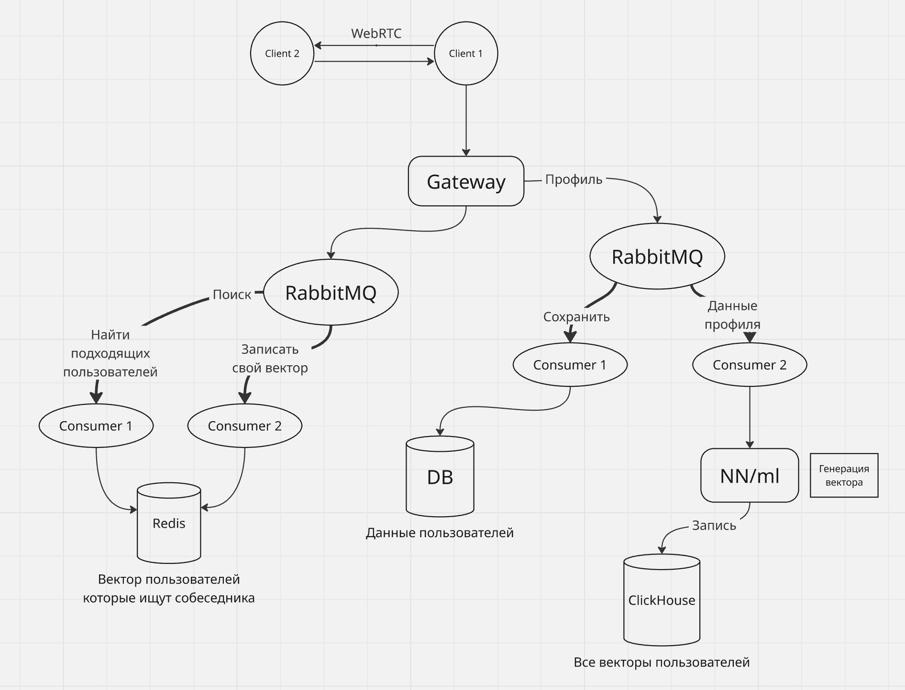

# Чатрулетка RuLetka

**RuLetka** — это не просто обычная чатрулетка, которая случайным образом соединяет пользователей между собой. Наша рулетка делает это основываясь на персональных интересах пользователя, анализируя его опыт с предыдущими собеседниками при помощи искусственного интеллекта. 

## Установка и запуск

### Требования

Установленный Dcoker

### Инструкция по запуску

1. Клонирование репозитория
```git clone https://github.com/MichaelNoskov/RuLetka```

2. Переходим в дирректорию проекта
```cd RuLetka```

3. Переименовать файл ```./backend/.env.example``` в ```./backend/.env```

4. Настраиваем по своему усмотрению (например, меняем порт сервера и т.п.) .env файл

5. ```pip install sentence-transformers``` - при необходимости создать виртуальное окружение В КОРНЕ ПРОЕКТА

6. ```cd ./backend/data_processor/models/```

7. ```python load.py``` - загрузит модель Rubert-Tiny2, необходимую для векторного описания клиента

8. ```cd ../../..``` - вернуться в корневую дирректорию проекта.

9. Поднимаем докер контейнеры
```docker-compose --env-file ./backend/.env up --build```

Swagger доступен по ссылке http://localhost:8000/docs если не был изменён порт в .env файле  

Frontend доступен по ссылке http://localhost:3000/  

Из-за проблем с безопасностью передачи медиаданных на данный момент не получится по http подключиться по локальной/глобальной сети. Для тестирования можно открыть два окна браузера (обычный и инкогнито) - так получится имитировать двух собеседников. ВАЖНО: для всех инкогнито вкладок общие куки, а значить и пользователя получится использовать дополнительно только одного  
  

## Структура сервисов
  
├── backend - бэкенд
│   ├── api - REST
│   │   ├── alembic - миграции для бд клиента (Postgres)
│   │   └── app - сервисы FastAPI
│   │       ├── auth - авторизация
│   │       ├── expirience - информация пользователя
│   │       └── rooms - основной функционал чат рулетки
│   ├── common - общие для бэкенда скрипты
│   │   ├── core - конфиги
│   │   ├── schemas - pydantic схемы
│   │   └── storage - всё для работы с различными бд
│   │       ├── click_migrations - миграции для ClickHouse
│   │       ├── models - модели данных
│   ├── data_processor - сервис с ИИ моделью, генерирующей векторное описание пользователя
│   │   ├── handlers
│   │   └── models - ИИ модели
│   │       └── rubert-tiny2
│   └── pg_consumer - consumer для обращений к postgres-у
│       └── handlers
├── frontend - фронтенд

  

